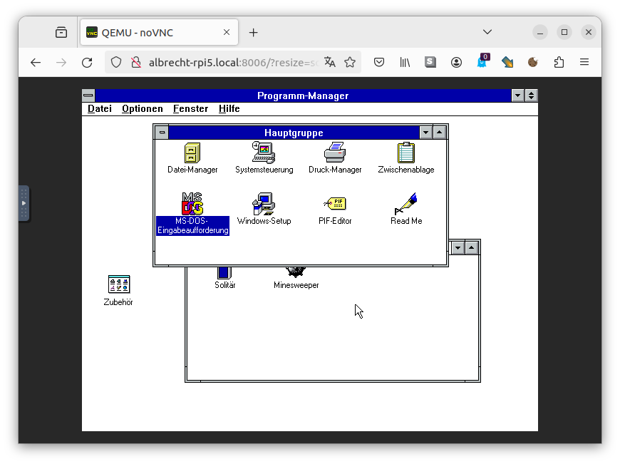
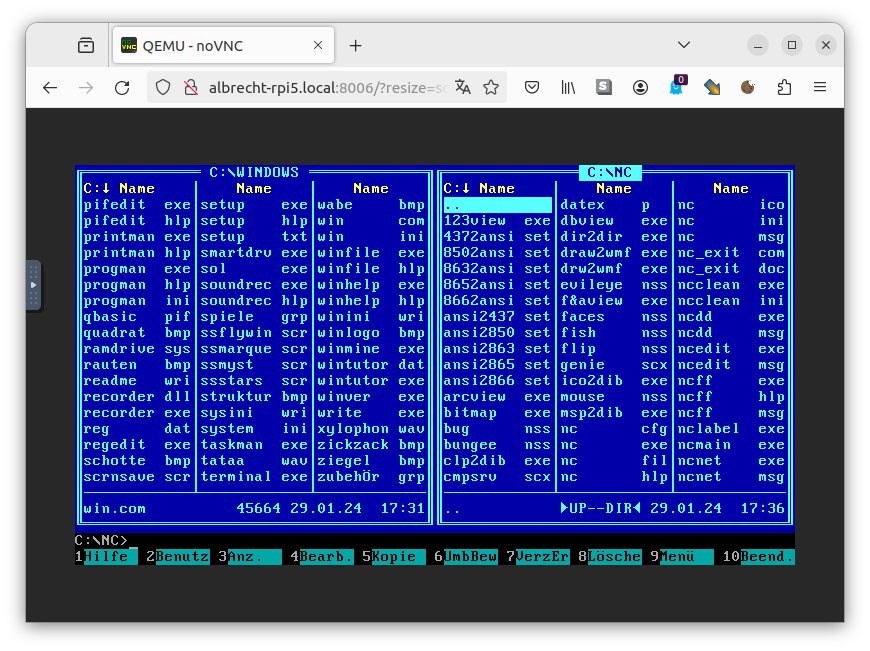
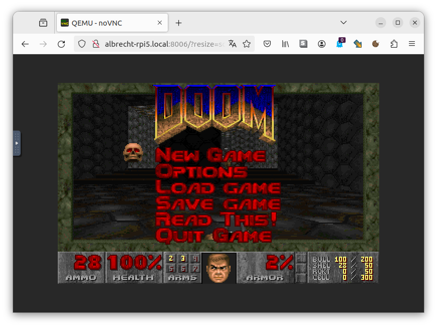

# MS DOS, Windows 3.1, Doom and Norton Commander qemu docker container for arm64. Yes arm64 not x86 based systems.

Based on the great works of https://github.com/qemus/qemu-docker. Thanks!
Similar idea: https://github.com/hectorm/docker-qemu-win2000

DOS, Windows 3.1, Doom and Norton Commander in a docker container for running on arm64. Tested on Raspberry Pi 5.

This project doesn't make any sense but is fun! I made it for an April fool for that reason the install software is in German.

Images can be found a docker hub  TBD

## Features

 - MS DOS 6.22
 - MS Windows 3.11
 - Doom 2.1
 - Norton Commander

## Usage

See `docker-compose.yml`

## How it works
See `src/entry.sh` and `Dockerfile`

## Build and run

```bash
docker build -t openwrt-docker-arm64 . && docker compose up
```

## Software sources

* MS DOS: https://winworldpc.com/download/2379c3a9-1008-c2ae-11c3-a7cb86c2bd52
* Doom 2.1: https://archive.org/details/doom1.21
* Windows 3.11: https://winworldpc.com/download/166a4cc2-b6c3-9d45-11c3-a6c2bb2a5254
* Norton Commander: https://winworldpc.com/download/44c3bb67-3f18-c39a-11c3-a4e284a2c3a5

### How to create a DOS HDD image

https://gunkies.org/wiki/Installing_MS-DOS_on_Qemu

### How to change floppy disks in qemu

https://rubenerd.com/changing-qemu-floppy-disks/

## Screenshots

All grafic output is done via VNC inside a web browser

Windows 3.11



![MS DOS 6.22]](pictures/qemu-docker-dos.png)



